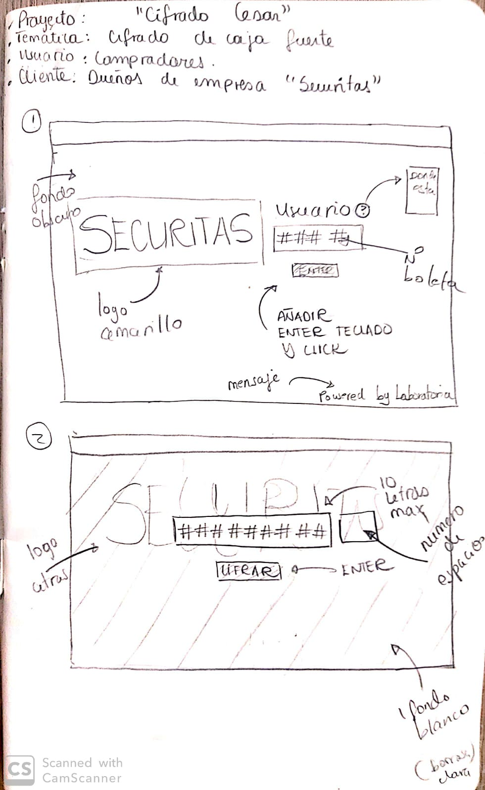
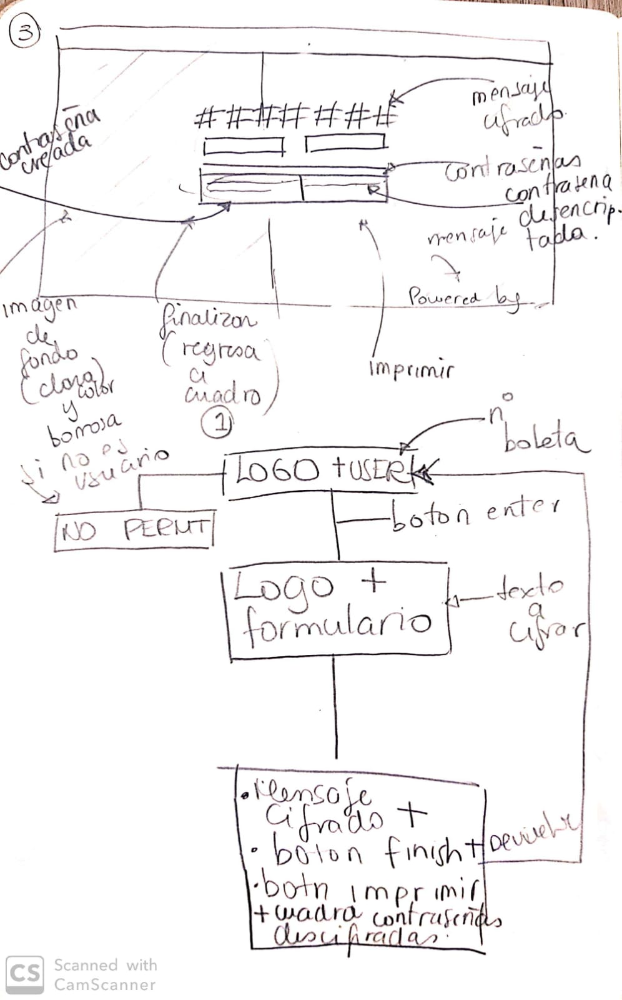
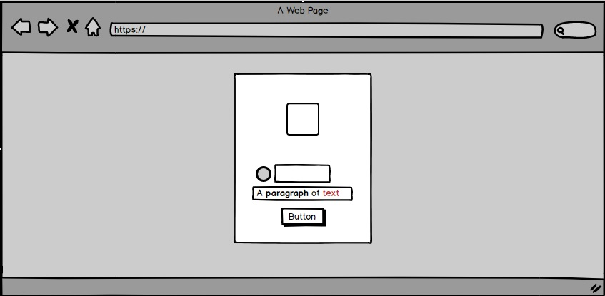
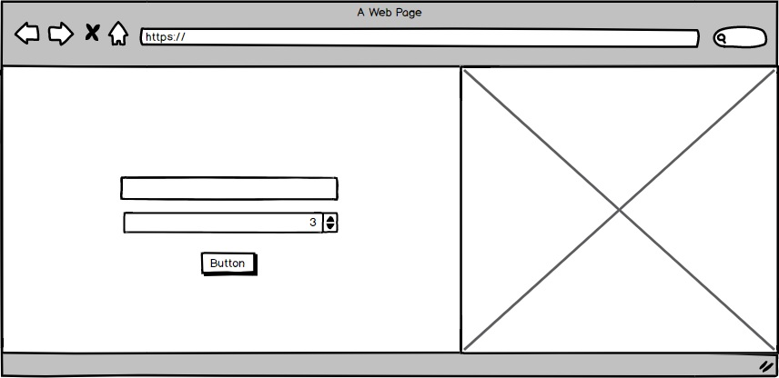
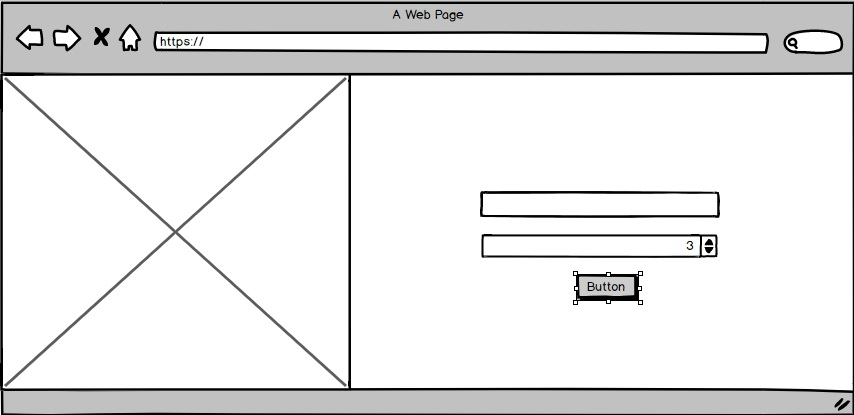
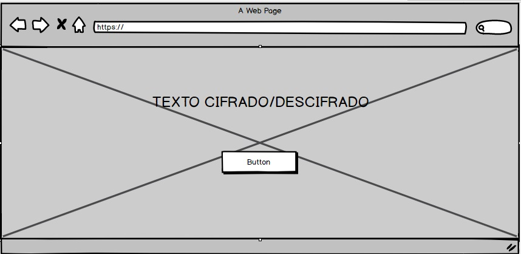

# Generador de claves de caja fuerte
## Descripción 📝
Esta es una aplicación web formulada para generar claves con el tipo de cifrado César para ser utilizadas en una caja fuerte personal de la marca SECURITAS®

## Construido con 🛠️

>- Photoshop
>- Visual Studio Code
>- Coolors

## Usuarios 👥
>Esta aplicacion web está diseñada para los clientes que compraron una caja fuerte de la marca SECURITAS y desean crear una clave segura para su producto.

## Creación de clave con la aplicación 🔒

>Al ingresar con el numero de boleta que se obtiene en la compra, el usuario introduce un mensaje en el recuadro, coloca el numero de espacios segun su preferencia y da click en el boton de "Cifrar", consecutivamente se le muestra el mensaje cifrado.

## Prototipo inicial y feedback ☝

1. Al inicio del proyecto tenia una idea de lo que iba a realizar, tenia que contener el logo de la empresa y un inicio de sesion para poder entrar a cifrar el texto.

    Este es el prototipo inicial del proyecto

2. En lo que tenia inconvenientes era en el final del proyecto y los estilos que iba a darle, entonces comence a pedir feedback sobre los colores y el posicionamiento de los elementos.

3. Fue ahi donde me dieron la idea de una imagen de fondo y un logo amarillo con negro.

4. Anadí varias pantallas para cifrar y descifrar que luego eliminé y lo sintetice todo en 3 unicas (inicio, panel de cifrado/descifrado, panel de texto cifrado/descifrado).

    Este era básicamente el proyecto.

## Prototipo final 🎓

>Este es el prototipo final del proyecto

* Página de inicio

* Página de cifrado

* Página de descifrado

* Página de visualización de texto

## Objetivos de aprendizaje 🎯

### UX

✔️ Diseñar la aplicación pensando y entendiendo al usuario

✔️ Crear prototipos para obtener feedback e iterar

✔️ Aplicar los principios de diseño visual
### HTML y CSS

✔️ Uso correcto de HTML semántico

✔️ Uso de selectores de CSS

✔️ Construir tu aplicación respetando el diseño realizado(maquetación).
### DOM
✔️ Uso de selectores de nodos del DOM

✔️ Manejo de eventos del DOM

✔️ Manipulación dinámica del DOM
### Javascript

✔️ Manipulación de strings

✔️ Uso de condicionales

✔️ Uso de bucles

✔️ Uso de funciones

✔️ Datos atómicos y estructurados

✔️ Utilizar ES Modules (`import` | `export`).

### Testing
✔️ Testeo de tus funciones
### Git y GitHub
✔️ Comandos de git
  (`add` | `commit` | `pull` | `status` | `push`).

✔️ Manejo de repositorios de GitHub (`clone` | `fork` | `gh-pages`).
### Buenas prácticas de desarrollo

✔️ Organizar y dividir el código en módulos (Modularización).

✔️ Uso de identificadores descriptivos (Nomenclatura | Semántica).

✔️ Uso de linter para seguir buenas prácticas (ESLINT).

## Comentarios finales 🗳️

    Luego de finalizar el proyecto y afinar algunos estilos, volví a mostrar el resultado a mi squad:

* "Me gusto el resultado y la combinacion de colores"
* "Fue mas legible que en un inicio y mas simple"
