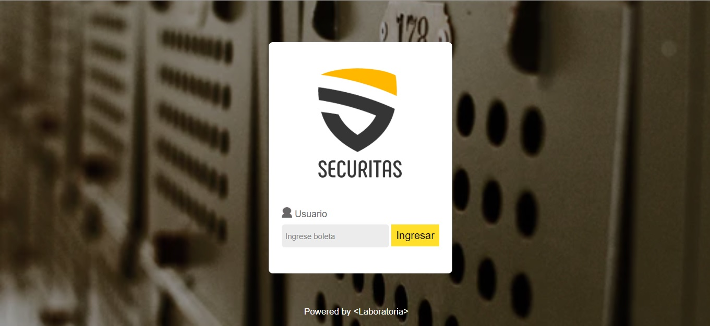

# Generador de claves de caja fuerte
## Descripción 📝
Esta es una aplicación web formulada para generar claves con el tipo de cifrado César para ser utilizadas en una caja fuerte personal de la marca SECURITAS®.

## Construido con 🛠️

- Photoshop
- Visual Studio Code
- Coolors

## Usuarios 👥
Esta aplicacion web está diseñada para los clientes que compraron una caja fuerte de la marca SECURITAS y desean crear una clave segura para su producto.

## Creación de clave con la aplicación 🔒

Al ingresar con el numero de boleta que se obtiene en la compra, el usuario introduce un mensaje en el recuadro, coloca el numero de espacios segun su preferencia y da click en el boton de "Cifrar", consecutivamente se le muestra el mensaje cifrado.

## Prototipo inicial

    Este es el prototipo inicial del proyecto

## Feedback del prototipo 👁️‍🗨️

