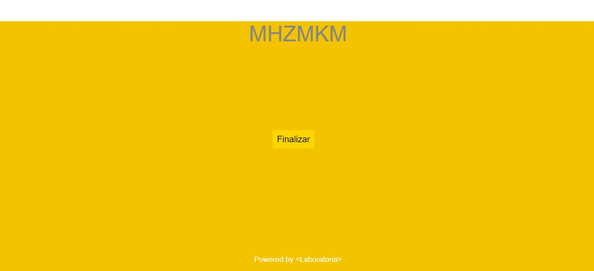

# Generador de claves de caja fuerte
## Descripción
Esta es una aplicación web formulada para generar claves con el tipo de cifrado César para ser utilizadas en una caja fuerte personal de la marca SECURITAS®.

## Construido con 🛠️

- Photoshop
- Visual Studio Code
- Coolors

