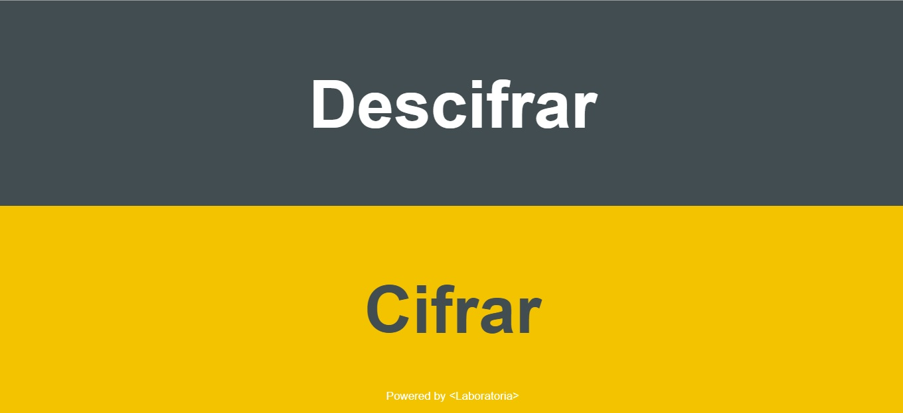
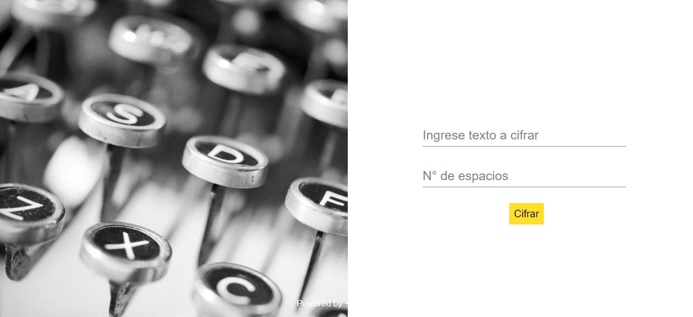

# Generador de claves de caja fuerte
## Descripción 📝
Esta es una aplicación web formulada para generar claves con el tipo de cifrado César para ser utilizadas en una caja fuerte personal de la marca SECURITAS®

## Construido con 🛠️

>- Photoshop
>- Visual Studio Code
>- Coolors

## Usuarios 👥
>Esta aplicacion web está diseñada para los clientes que compraron una caja fuerte de la marca SECURITAS y desean crear una clave segura para su producto.

## Creación de clave con la aplicación 🔒

>Al ingresar con el numero de boleta que se obtiene en la compra, el usuario introduce un mensaje en el recuadro, coloca el numero de espacios segun su preferencia y da click en el boton de "Cifrar", consecutivamente se le muestra el mensaje cifrado.

## Prototipo inicial y feedback ☝

1. Al inicio del proyecto tenia una idea de lo que iba a realizar, tenia que contener el logo de la empresa y un inicio de sesion para poder entrar a cifrar el texto.

    Este es el prototipo inicial del proyecto

2. En lo que tenia inconvenientes era en el final del proyecto y los estilos que iba a darle, entonces comence a pedir feedback sobre los colores y el posicionamiento de los elementos.

3. Fue ahi donde me dieron la idea de una imagen de fondo y un logo amarillo con negro.

4. Anadí varias pantallas para cifrar y descifrar que luego eliminé y lo sintetice todo en 3 unicas (inicio, panel de cifrado/descifrado, panel de texto cifrado/descifrado).

    Este era básicamente el proyecto.

## Prototipo final y comentarios 🎓🗳️

![Image7] (7.jpg)

